# AI Security Scanner for AWS S3

**Project Link:** [View Project](http://learn.nextwork.org/projects/ai-aws-s3-security)

**Author:** Dumanyie Chamberlain  
**Email:** dumanyiechamberlain@gmail.com

---


---

## Introducing Today's Project!

I’m building an AI-powered security scanner using AWS Lambda that checks whether S3 buckets are properly encrypted, sends the findings to Gemini AI for analysis, and generates intelligent security insights. The system runs automatically every 12 hours using EventBridge, so it continuously monitors the environment without manual intervention.

I’m doing this to learn how serverless security automation works in real-world cloud environments. I want to understand how Lambda, IAM roles, S3, EventBridge, and external AI services can be integrated into a practical security workflow. This project also helps me strengthen my cloud security architecture skills and deepen my understanding of detection and automated analysis.

This helps me develop hands-on experience with security monitoring, compliance validation, and AI-assisted threat assessment.

### Key tools and concepts

The key tools I used were AWS Lambda for serverless execution, Amazon EventBridge for scheduled automation, Amazon S3 for storage and encryption evaluation, and Amazon CloudWatch for logging and monitoring within Amazon Web Services; the main concepts I learned were event-driven architecture, scheduled automation, secure environment variable management, IAM-based permission control, serverless deployment packaging, and how to transform raw cloud security metadata into meaningful, AI-powered security insights.

### Challenges and wins

and automate within Amazon Web Services, especially while ensuring my dependencies were compatible with AWS Lambda; the most challenging part was resolving the runtime import errors caused by mismatched compiled libraries and correctly rebuilding them in a Linux-compatible environment, as well as configuring scheduled automation with Amazon EventBridge and validating execution logs inside Amazon CloudWatch to confirm everything was running seamlessly end-to-end.

### Why I did this project

I did this project to strengthen my practical cloud security skills and move beyond theory into building a real, automated security workflow inside Amazon Web Services; I wanted hands-on experience with serverless architecture using AWS Lambda, scheduled automation with Amazon EventBridge, storage security validation in Amazon S3, and log monitoring through Amazon CloudWatch, while also integrating AI to interpret security findings; yes, the project met my goals because it helped me understand deployment packaging, permissions, automation, and how to transform raw cloud configuration data into meaningful, actionable security insights in a production-style setup.

---

## Get API Key & Write Scanner

### Setting Up Gemini AI

I’m getting a Gemini API key from Google AI Studio and writing a Lambda-based S3 encryption scanner in Cursor. The scanner will check my S3 buckets for encryption gaps and send the findings to Gemini for intelligent analysis and recommendations. I’m structuring the code so it’s clean, modular, and ready to deploy directly into AWS Lambda.

This helps me understand how to securely integrate third-party AI services into cloud security workflows. It also strengthens my skills in serverless development, API integration, and automated compliance monitoring. Most importantly, it’s helping me think like a security engineer — not just detecting issues, but translating them into actionable insights.

### Understanding the Code

Gemini AI is Google’s large language model that can analyze text and generate intelligent explanations and recommendations. Instead of just showing raw security findings, it can interpret what those findings mean and suggest practical next steps.

I’m using it to turn the raw output from my S3 encryption scanner into clear, actionable security insights. Rather than manually reviewing bucket configurations, I can have AI explain risks, highlight compliance gaps, and recommend remediation steps in plain language.

The API key authenticates my application with Google AI Studio, allowing my Lambda function to securely send scan results to Gemini and receive analysis in return. It ensures that only authorized requests from my project can access the AI service.


### Writing the Scanner Code

The scanner begins by initializing a secure connection to AWS S3 while simultaneously preparing the Gemini AI engine for data analysis. It then performs an automated sweep across the entire cloud environment to discover every active S3 bucket, acting as a digital inventory. Once the buckets are identified, the code probes each one’s metadata to verify if data-at-rest encryption is active; any bucket missing these protections is immediately flagged as a vulnerability. Finally, the system passes these security findings to the AI, which translates technical gaps into clear, natural-language risk assessments, explaining exactly why each unencrypted bucket poses a threat to the organization.

---

## Package Code & Create IAM Role

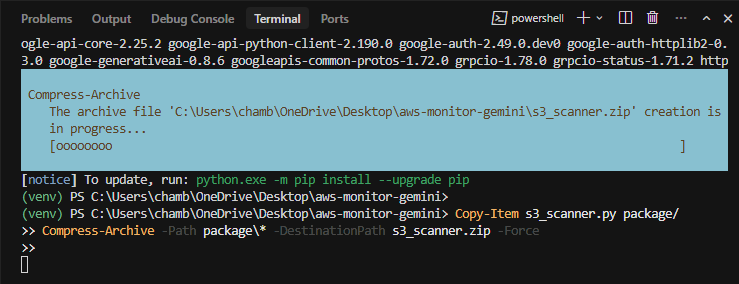


### Preparing the Deployment Package

I’m packaging my code with its dependencies into a deployment-ready zip file so it can run inside AWS Lambda’s serverless environment.

In this step, I’m using Lambda to execute my Python scanner, the S3 API to retrieve bucket encryption configurations, and IAM to securely grant the function permission to read those settings. I’ll attach an IAM role to Lambda so it can access S3 without exposing credentials directly in my code.

This step is basically about defining the architecture of my security scanner — understanding how these AWS components work together. Instead of managing servers, I’m focusing on secure permissions, clean packaging, and letting AWS handle execution and scaling automatically.

### Attaching Policies to the Role

I packaged my code by creating a deployment folder that includes my Python scanner script along with all required external libraries installed locally. I used pip to install the dependencies into the same directory so everything Lambda needs is bundled together.

The requirements.txt file lists all the external packages my project depends on, such as the AWS SDK and the Gemini API client library. This file ensures the environment is reproducible and clearly documents what the project relies on.

The zip file contains my main Lambda function file plus all installed dependencies. This complete package is what I uploaded to AWS Lambda so the function can execute properly in the serverless environment without missing modules.


## Navigating, Defining and Creating Policies:
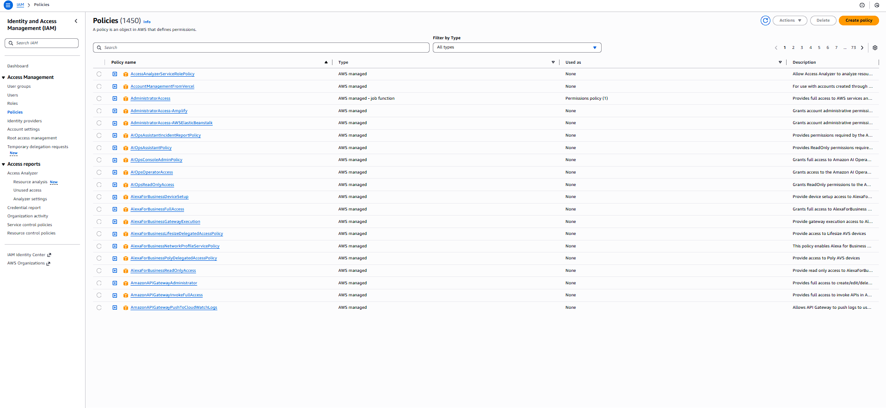
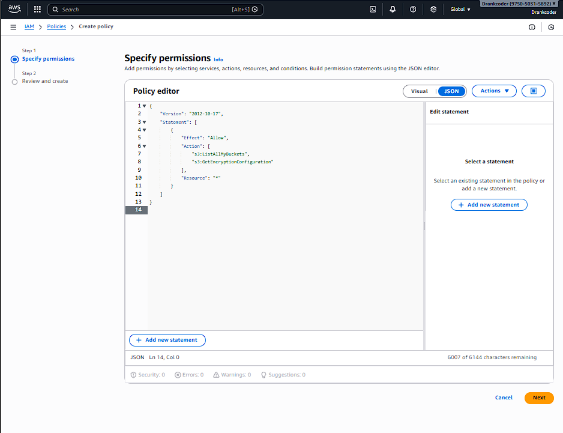
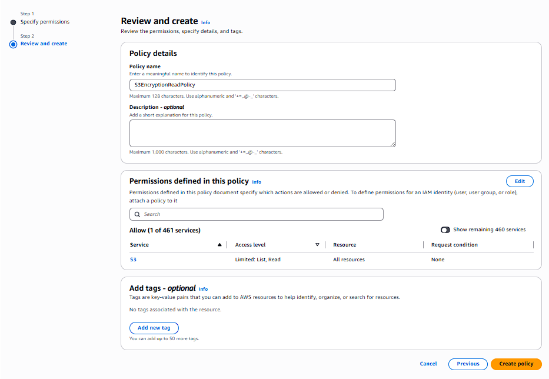

The policy is named `S3EncryptionReadPolicy`.

An optional description can be added.

The permissions summary shows that S3 List and Read actions are allowed on all resources.

Click Create policy to save it.


### Setting Up IAM Permissions

I created an IAM role called LambdaS3ScannerRole. The policies I attached were AWSLambdaBasicExecutionRole (AWS managed) and S3EncryptionReadPolicy (Customer managed). These permissions allow Lambda to write logs to CloudWatch and read encrypted S3 objects.
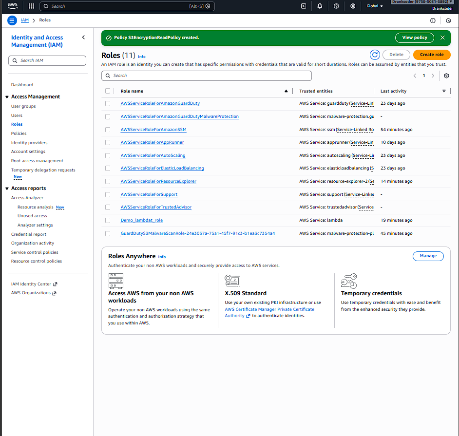
After creating the policy, a confirmation message appears: “Policy S3EncryptionReadPolicy created.”
The Roles page lists existing roles; the user will now create a new role for Lambda.

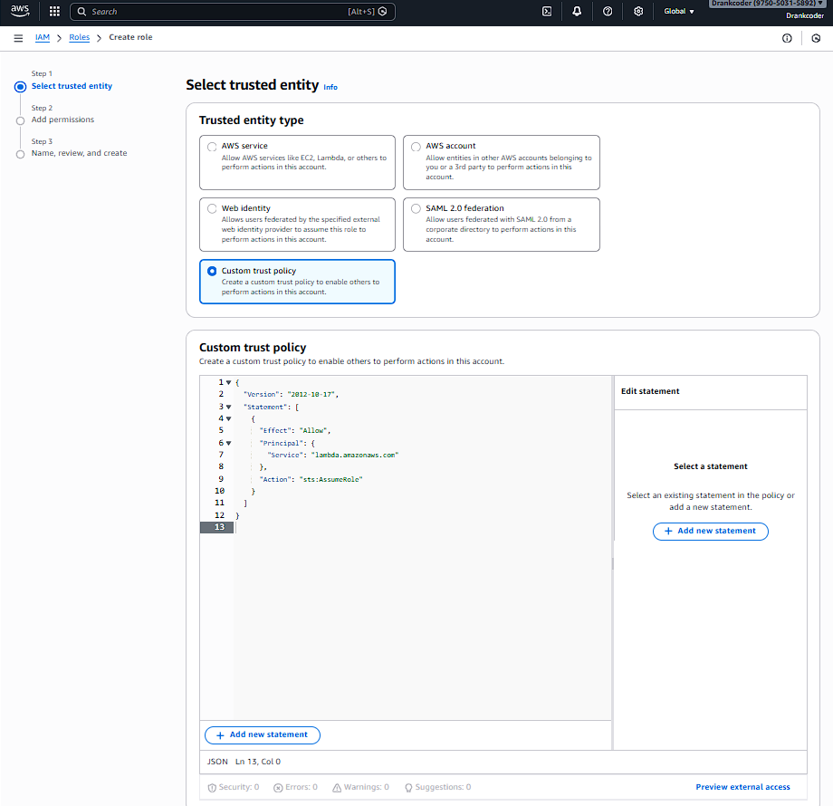

Defining Trust Policies

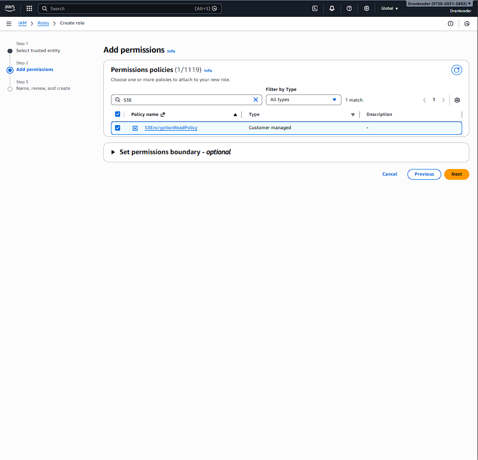
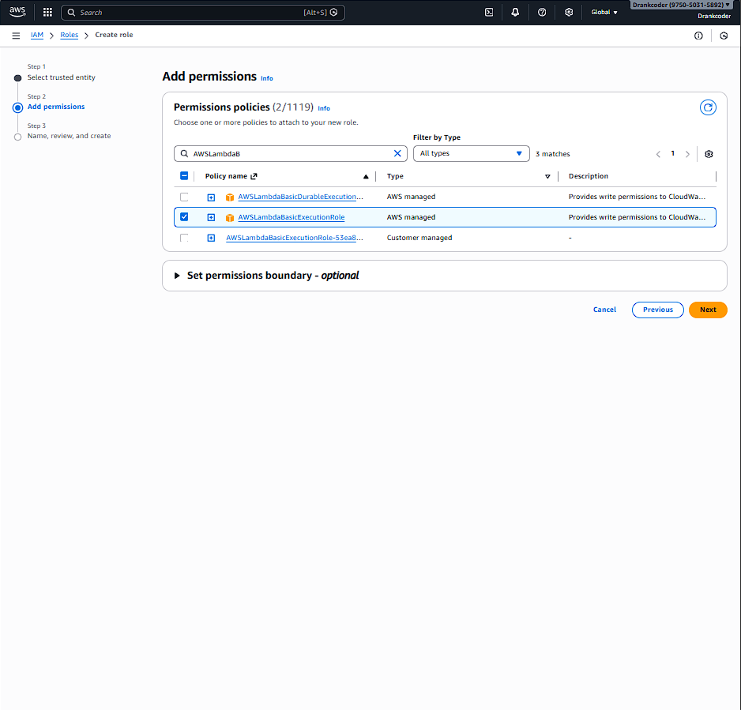
Attaching these permissions to policies

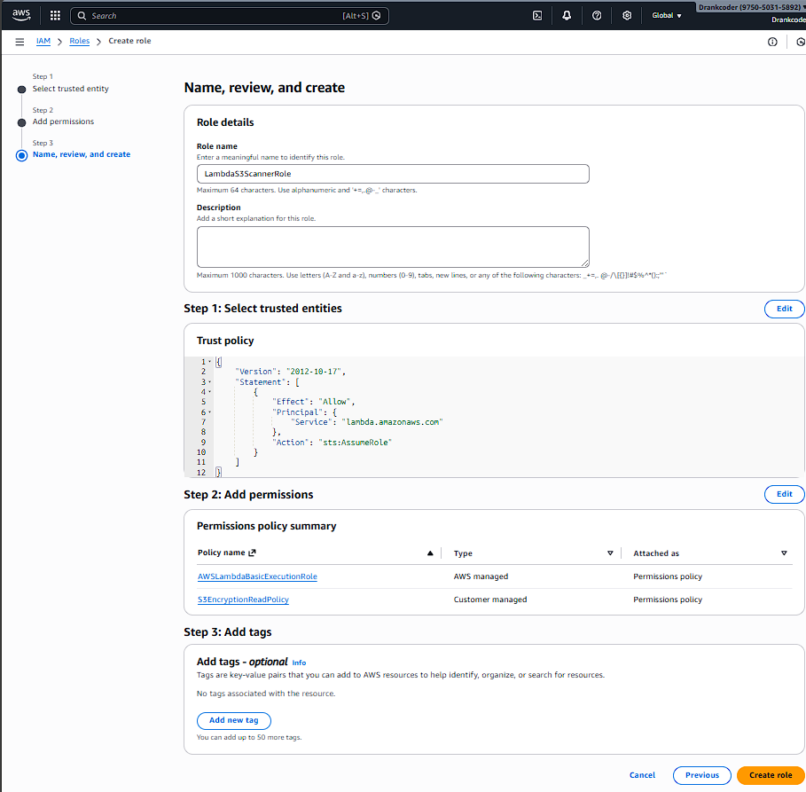
Naming and creating the role.
Give the role a meaningful name, e.g., LambdaS3ScannerRole.

Review the trust policy and the attached permissions:

AWSLambdaBasicExecutionRole (AWS managed)

S3EncryptionReadPolicy (customer managed)

Add optional tags if desired.

Click Create role.

---

## Deploying and Testing Lambda
Open the AWS Lambda Console and click Create function.
Choose Author from scratch.
Enter the following:
Function name: s3-security-scanner
Runtime: Python 3.14
Architecture: x86_64
Under Permissions, expand Change default execution role.
Select Use an existing role.
From the dropdown, choose the role you created earlier: LambdaS3ScannerRole.
Click Create function.
The role you selected already includes the necessary permissions (S3EncryptionReadPolicy and AWSLambdaBasicExecutionRole).
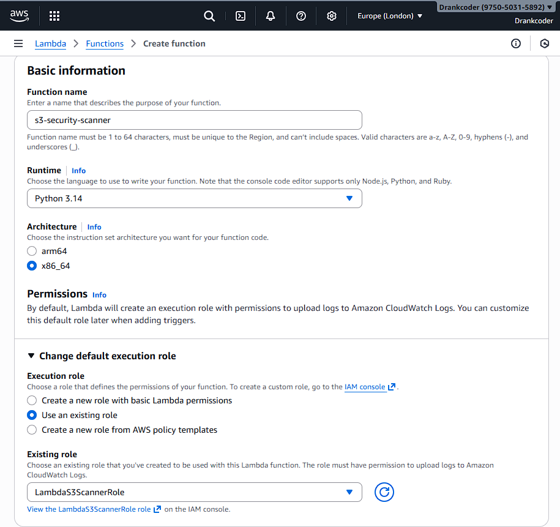


### Uploading the Function to AWS

I’m deploying my Lambda function and configuring it to run my s3_scanner.py file inside AWS Lambda by uploading my packaged function.zip, setting the handler to s3_scanner.lambda_handler, and confirming the runtime matches Python 3.10 with the correct architecture; then I securely add my Gemini API key as an environment variable under Configuration so it isn’t hardcoded in my script, and finally I create a test event to invoke the function, check the execution results and logs, and verify that my AI-powered S3 security scanner runs successfully and returns the expected analysis without import or permission errors within the Amazon Web Services console.

### Testing the Security Scanner

I configured the handler by updating the Handler field from lambda_function.lambda_handler to s3_scanner.lambda_handler in the Runtime settings, and added my Gemini API key as an environment variable named GOOGLE_API_KEY under the Configuration tab. Environment variables work by securely storing key‑value pairs that are injected into the Lambda execution environment, allowing my code to access sensitive credentials like the API key using os.environ. The handler tells the Lambda service exactly which file and function to execute when the function is invoked—in this case, the lambda_handler function inside s3_scanner.py.


### Configuring Environment Variables

I tested my Lambda by invoking it with a sample S3 event in AWS Lambda, and it executed without import or permission errors; the AI analysis explained the security posture of the scanned object, highlighting potential risks and giving contextual recommendations based on the content reviewed; this shows the scanner successfully integrates S3 inspection with AI-powered evaluation, confirming that my deployment, environment variable configuration, and permissions are correctly set up within Amazon Web Services.

---

## Automated Security Scans

### Setting Up EventBridge Scheduling

I am going to create an automated scheduled rule using Amazon EventBridge, configure it to run every 12 hours, and set my s3-security-scanner function in AWS Lambda as the target so the scan runs automatically without manual intervention; after reviewing the schedule, permissions, and target configuration, I will create and enable the rule to ensure continuous, hands-off S3 encryption monitoring as part of my security workflow within Amazon Web Services.

### How EventBridge Scheduling Works

I configured Amazon EventBridge by navigating to Rules, using the scheduled rule builder, naming the rule daily-s3-security-scan, and setting the schedule to run at a regular rate of every 12 hours; I then selected Lambda function as the target type and chose my s3-security-scanner function in AWS Lambda, reviewed the rule details to confirm the name, schedule, and target configuration were correct, and created the rule; the schedule now runs automatically every 12 hours, and this automates security monitoring by triggering my Lambda function consistently to perform S3 encryption scans without any manual intervention inside Amazon Web Services.


### Production Workflow and Monitoring
# Wrap‑Up: Deploying and Monitoring the S3 Encryption Scanner

This final part of the documentation covers how to verify the automated schedule, monitor the Lambda function’s execution through CloudWatch Logs, and an alternative method for packaging dependencies using Docker. After these steps, your AI‑powered security scanner will be running fully automatically.

---

## Step 9: Verify the EventBridge Schedule

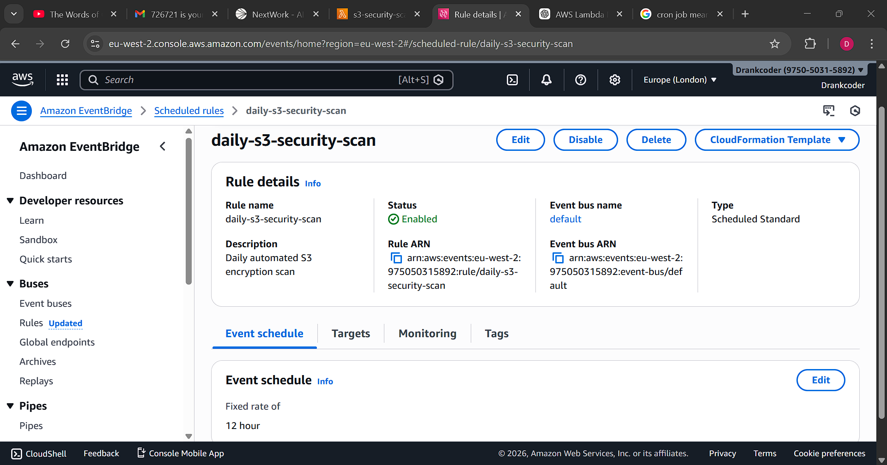

Once the EventBridge schedule is created, you can review its details in the console:

1. In the AWS Console, navigate to **Amazon EventBridge** → **Scheduler** → **Schedules**.
2. Locate the schedule named `daily-s3-security-scan`.
3. The overview confirms:
   - **Status**: Enabled
   - **Type**: Scheduled Standard
   - **Schedule expression**: `rate(12 hours)`
   - **Target**: The Lambda function `s3-security-scanner`
   - **Permissions**: An execution role has been automatically created to allow EventBridge to invoke the function.

You can also see the rule’s ARN, event bus, and any attached tags. This page confirms that your automation is active and will trigger the scanner twice daily.

---

## Step 10: Monitor Execution in CloudWatch Logs

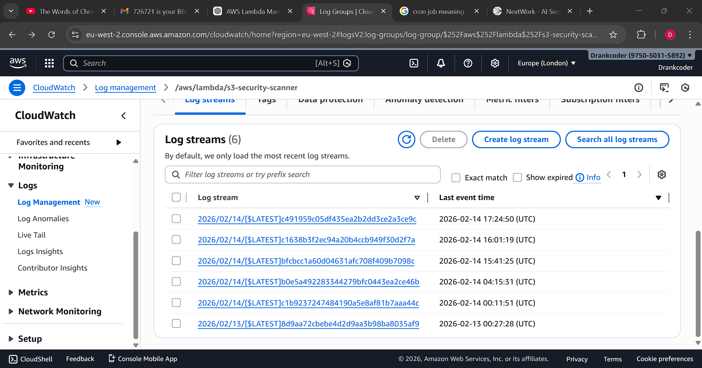  


Every time the Lambda function runs (whether manually or via the schedule), it logs details to Amazon CloudWatch Logs. You can monitor these logs to verify correct operation and to review the AI‑generated risk explanations.

1. In the Lambda console, open your function (`s3-security-scanner`).
2. Go to the **Monitor** tab and click **View CloudWatch Logs**.
   - Alternatively, navigate directly to **CloudWatch** → **Log groups** and select the log group named `/aws/lambda/s3-security-scanner`.
3. You will see a list of **log streams**, each corresponding to a separate invocation. The streams are named with the date and a unique identifier (e.g., `2026/02/14/[$LATEST]c4919...`).
4. Click on a log stream to view the individual log events.

**What to look for in the logs:**

- **Start and End messages** – confirm the invocation ran completely.
- **Any error messages** – if the Gemini API key is missing or the model name is incorrect, you’ll see exceptions here.
- **The scan results** – the function prints the list of buckets and their encryption status, plus the AI‑generated risk analysis for unencrypted buckets.

Image 26 shows a sample log event with the Gemini deprecation notice, the import statement, and the start/end of the request. This helps you debug and verify that the AI integration is working.

---

## Step 11: (Optional) Building the Deployment Package with Docker

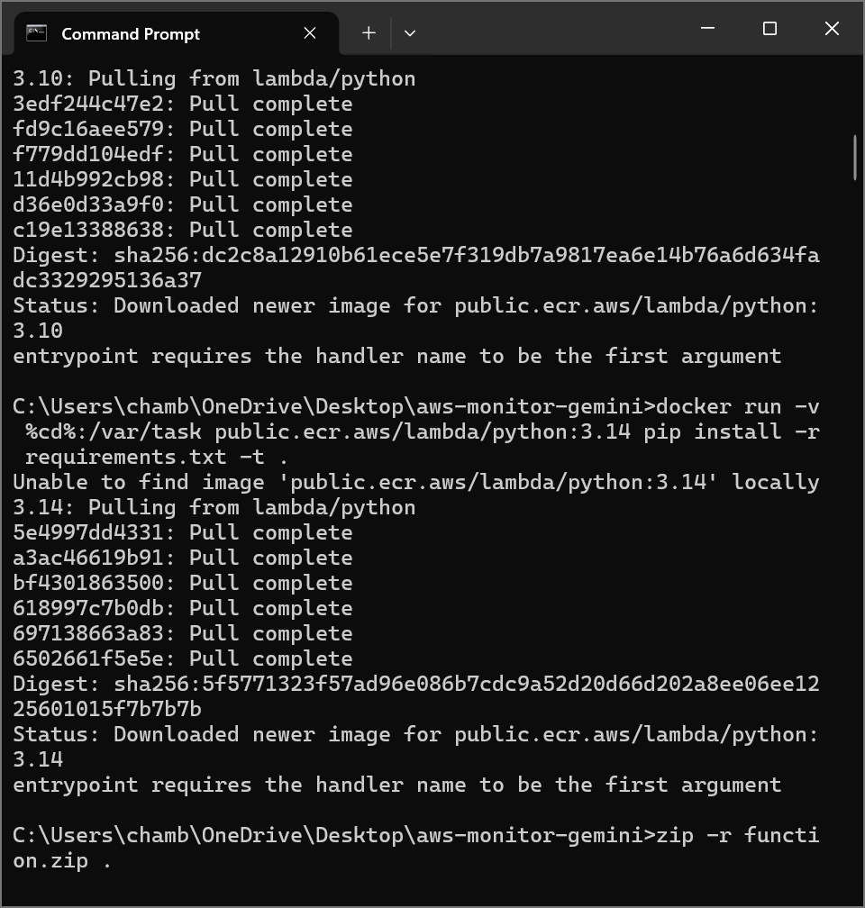  
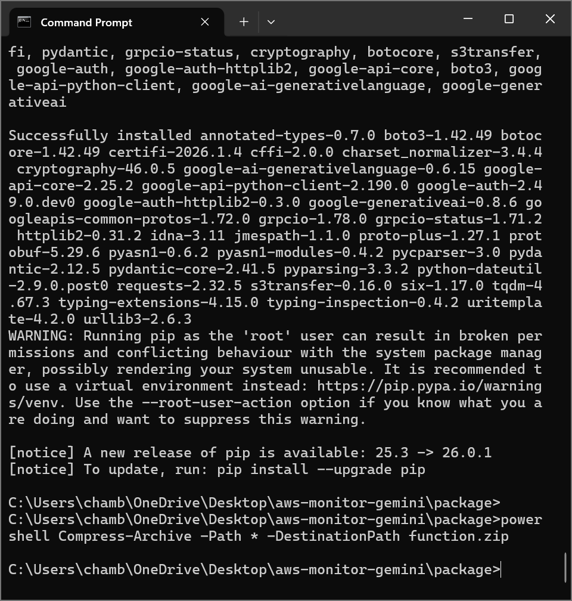

If you need to recreate the deployment package (for example, to update dependencies or change the Python version), using a Docker container that mimics the Lambda execution environment is the recommended approach. The images show a local development session where the user pulled the AWS Lambda Python image and installed requirements.

### 11.1 Pull the Lambda Python Image

```bash
docker pull public.ecr.aws/lambda/python:3.14
```

### 11.2 Install Dependencies into a Local Folder

Run a container that mounts your current directory and installs the packages from `requirements.txt` into that folder:

```bash
docker run --rm -v %cd%:/var/task public.ecr.aws/lambda/python:3.14 pip install -r requirements.txt -t .
```

On Linux/macOS, replace `%cd%` with `$(pwd)`.

This command installs all necessary libraries (boto3, google‑generativeai, etc.) directly into the current directory, ready to be packaged with your Lambda code.

### 11.3 Create the ZIP Archive

After the dependencies are installed, you can compress everything:

```bash
zip -r function.zip .
```

Or, if you prefer PowerShell (as seen in the image):

```powershell
Compress-Archive -Path * -DestinationPath function.zip
```

The resulting `function.zip` can then be uploaded to Lambda.

> **Note:** The images show a warning about running pip as root – this is expected inside a container and can be ignored. Also, a newer pip version is available, but it’s not required for the package to work.

---

## Conclusion

You have now built and deployed a fully automated security monitoring solution for Amazon S3. The system:

- Scans all S3 buckets in your account **every 12 hours** using an EventBridge schedule.
- Checks whether **server‑side encryption** is enabled on each bucket.
- For any unencrypted bucket, invokes **Google’s Gemini AI** to generate a clear, human‑readable explanation of the security risk.
- Logs all results to **CloudWatch Logs** for auditing and further analysis.

This project demonstrates how to combine AWS serverless services (Lambda, EventBridge, IAM, CloudWatch) with external AI APIs to create a practical, low‑maintenance security tool. By automating the scan, you ensure continuous compliance without manual effort, and the AI‑generated insights make it easy to communicate risks to stakeholders.

### Potential Enhancements

- **Add alerts** – Use CloudWatch Alarms or Amazon SNS to notify a security team when an unencrypted bucket is found.
- **Expand the scan** – Include other security checks, such as bucket public access blocks or versioning status.
- **Store results** – Write the findings to a DynamoDB table or an S3 bucket for long‑term trend analysis.
- **Improve AI prompts** – Customize the Gemini prompt to include compliance frameworks (e.g., HIPAA, PCI‑DSS) or to suggest remediation steps.

With this foundation, you can easily extend the scanner to meet your organization’s evolving security needs.

---

## Wrap-up

---
## Conclusion

You have now built and deployed a fully automated security monitoring solution for Amazon S3. The system:

- Scans all S3 buckets in your account **every 12 hours** using an EventBridge schedule.
- Checks whether **server‑side encryption** is enabled on each bucket.
- For any unencrypted bucket, invokes **Google’s Gemini AI** to generate a clear, human‑readable explanation of the security risk.
- Logs all results to **CloudWatch Logs** for auditing and further analysis.

This project demonstrates how to combine AWS serverless services (Lambda, EventBridge, IAM, CloudWatch) with external AI APIs to create a practical, low‑maintenance security tool. By automating the scan, you ensure continuous compliance without manual effort, and the AI‑generated insights make it easy to communicate risks to stakeholders.

### Potential Enhancements

- **Add alerts** – Use CloudWatch Alarms or Amazon SNS to notify a security team when an unencrypted bucket is found.
- **Expand the scan** – Include other security checks, such as bucket public access blocks or versioning status.
- **Store results** – Write the findings to a DynamoDB table or an S3 bucket for long‑term trend analysis.
- **Improve AI prompts** – Customize the Gemini prompt to include compliance frameworks (e.g., HIPAA, PCI‑DSS) or to suggest remediation steps.

With this foundation, you can easily extend the scanner to meet your organization’s evolving security needs.
---
